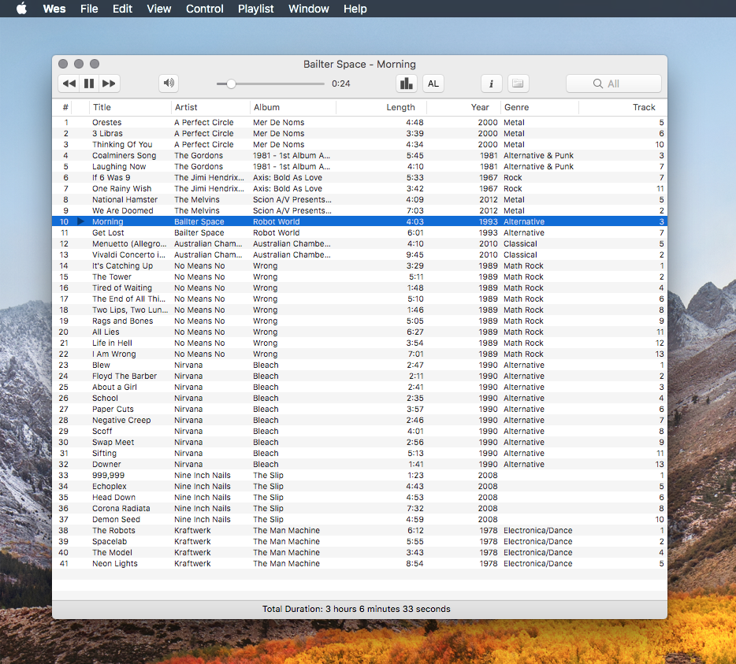

# Wes

Wes aims to be a simple desktop music player.

It's goal is to be a application along the lines of the original Winamp or the original iTunes. If you use a Mac and miss the days of simple desktop music players, Wes might be the thing for you.

Wes was forked from an old applciation called _Cog_ (see the [orignial readme](#Original%20Readme) section below). I've started stripping things out of the original app I didn't want - last.fm integration, growl notifications, auto update, internet play, and anything else that got in the way of just playing some local files. It's a bit messy in there, but it's close to exacty what I want.

_Cog_ hadn't been updated since 2010 so I've started trying to bring it into 2019. Beause it's a bit older, Wes is a bit finiky at the moment, and he sometimes just drops off in the middle of a solo (aka crashes) on some formats.

In general, he works pretty well with the following:

* MP3 (44100, 128bit, 2 channel - other encodings can crash at the moment)
* AAC
* Apple Lossless
* WAV
* AIFF
* Ogg Vorbis (untested)
* FLAC (untested)
* Codecs supported Mac OS X Core Audio API

It can load playlists (and saves them) in the following formats:

* M3U
* PLS (untested)

## FAQ

Q: what does Wes stand for?

A: [Wes Montgomery](https://en.wikipedia.org/wiki/Wes_Montgomery)

## Original Readme

Cog is authored by Vincent Spader. It is released under the GPL. See COPYING for details.

The libraries folder contains various decoding and tagging libraries, which i have created Xcode projects for, and possibly modified to make compile on OS X. The various libraries are under each of their own licenses/copyrights.

All Cog code is copyrighted by me, and is licensed under the GPL. Cog contains bits of other code from third parties that are under their own licenses/copyright.

If you would like the photoshop sources for the various icons and graphics, please send me an email, and I will be happy to get them to you.

Share and enjoy.

-- Vincent Spader (vspader@users.sf.net)
